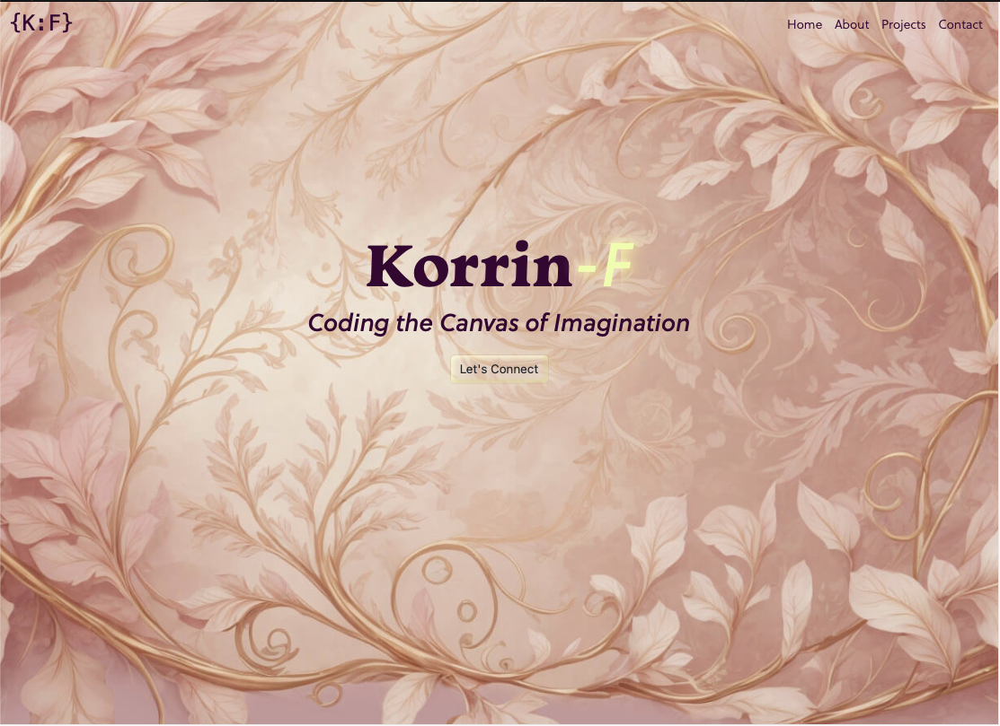

# Your Project Title

## Description 

# Korrin-F Portfolio

## Description
Welcome to my portfolio! The design is very much my style so it was a lot of fun to make. In the interest of practicing React I have built the portfolio as a React app. The hero image was created using AI and from there I chose a matching and complimentary colour pallete. I also chose three font families from Adobe fonts that suites the over all asethetic. 

## Installation

The packages are managed using NPM.

## Usage 

Follow this link to see my portfolio [Portfolio](https://korrin-f.github.io/portfolio-react/#/)

- There are no particular usage instructions other than follow the various navigations.

To add a screenshot, create an `assets/images` folder in your repository and upload your screenshot to it. Then, using the relative filepath, add it to your README using the following syntax:

## License

See licence in repo.

## Badges

